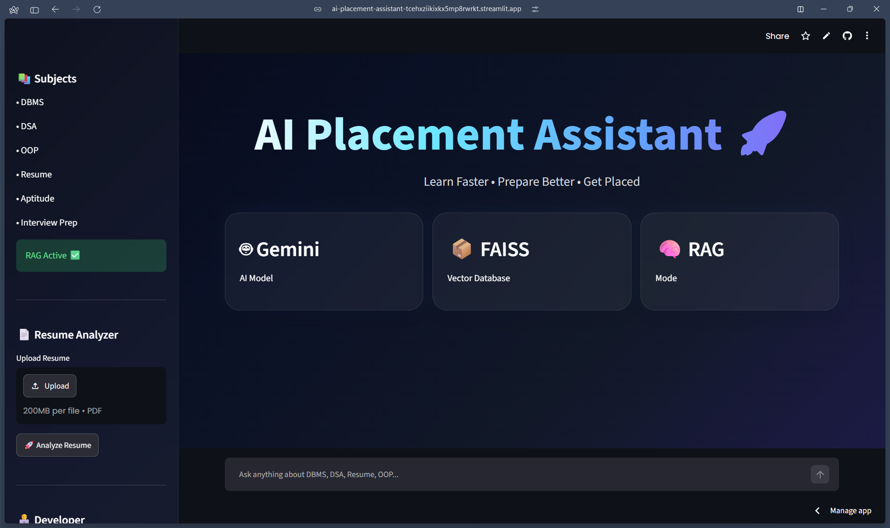
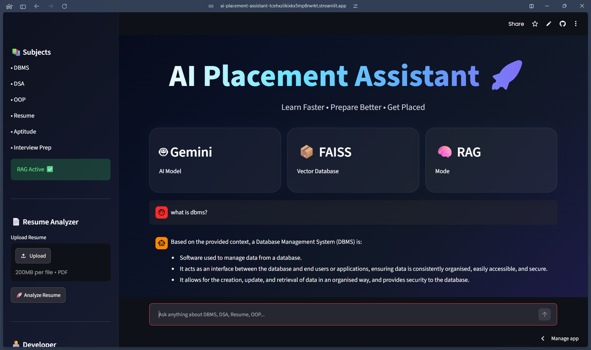
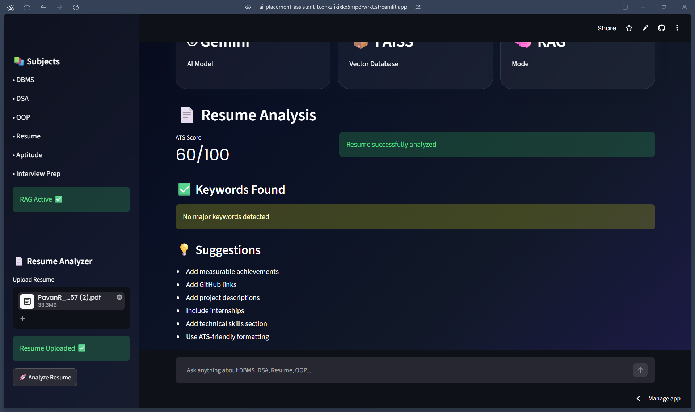

# 🚀 AI Placement Assistant

An AI-powered Placement Preparation Assistant built using **Gemini, LangChain, FAISS, Hugging Face Embeddings, and Streamlit**.

This project helps students prepare for placements by providing intelligent question-answering, resume analysis, and interview preparation support through a modern AI-powered interface.

## 🌐 Live Demo

**Live Application:**
https://ai-placement-assistant-tcehxziikixkx5mp8rwrkt.streamlit.app/

---

## ✨ Features

### 🤖 RAG-Based AI Assistant

* Retrieval-Augmented Generation (RAG)
* Context-aware responses using custom study materials
* Reduced hallucinations through document retrieval

### 📚 Placement Preparation

* DBMS Questions
* DSA Concepts
* OOP Principles
* Aptitude Preparation
* Interview Preparation

### 📄 Resume Analyzer

* Resume Upload Support
* ATS-style Scoring
* Resume Evaluation
* Improvement Suggestions

### 💬 Interactive Chat

* Chat History
* Real-time Responses
* Modern Streamlit Interface

### ☁️ Cloud Deployment

* Hosted on Streamlit Cloud
* GitHub Version Control
* Publicly Accessible Application

---

## 🏗️ System Architecture

User Query

↓

Hugging Face Embeddings

↓

FAISS Vector Search

↓

Relevant Context Retrieval

↓

Google Gemini

↓

AI Generated Response

---

## 🛠️ Tech Stack

### Languages

* Python

### AI & Machine Learning

* Google Gemini API
* LangChain
* Hugging Face Embeddings
* FAISS Vector Database

### Frontend

* Streamlit

### Deployment

* GitHub
* Streamlit Community Cloud

---

## 📸 Application Screenshots

### Home Page



### AI Question Answering



### Resume Analyzer




---

## 📂 Project Structure

AI-Placement-Assistant/

├── documents/

├── src/

│ ├── chatbot.py

│ ├── pdf_loader.py

│ └── vector_store.py

├── vector_db/

├── main.py

├── requirements.txt

├── README.md

└── .gitignore

---

## 🚀 Installation

Clone the repository:

```bash
git clone https://github.com/pavan19-06/AI-Placement-Assistant.git
cd AI-Placement-Assistant
```

Install dependencies:

```bash
pip install -r requirements.txt
```

Create a `.env` file:

```env
GEMINI_API_KEY=YOUR_API_KEY
```

Run the application:

```bash
streamlit run main.py
```

---

## 🎯 Key Learnings

* Retrieval-Augmented Generation (RAG)
* Vector Databases using FAISS
* Embedding Models
* Prompt Engineering
* Gemini API Integration
* Streamlit Deployment
* Git & GitHub Workflow

---

## 👨‍💻 Developer

**Pavan R**

AI & Machine Learning Student

### Connect

* GitHub: https://github.com/pavan19-06

---

## ⭐ Future Improvements

* AI-Powered ATS Resume Scoring
* Voice-Based Interview Assistant
* Personalized Learning Paths
* Multi-Document Retrieval
* Analytics Dashboard
* Enhanced UI Animations

---

If you found this project interesting, consider giving it a ⭐ on GitHub.
